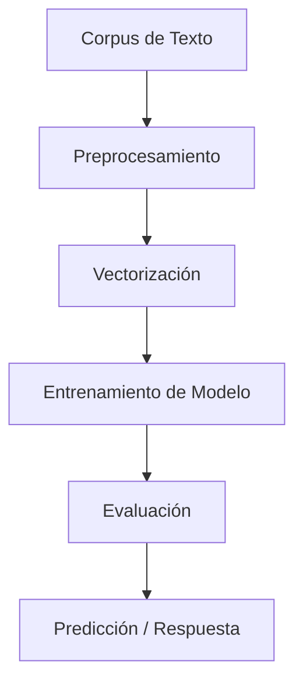

# Procesamiento de Lenguaje Natural.

Este repositorio contiene el desarrollo de los **Desafíos** realizados en el marco de la materia **Procesamiento de Lenguaje Natural (PLN)**, correspondiente a la **Especialización en Inteligencia Artificial** de la **Facultad de Ingeniería de la Universidad de Buenos Aires (FIUBA)**.

👤 **Autor:** Marcelo Adrián Más Valdecantos  
📘 **Código de alumno:** a1811  

---

## Contenido del repositorio

### 1️ Desafío 1 – Vectorización y Clasificación de Textos

> **Tema:** Dataset *20 Newsgroups*, vectorización con **TF-IDF**, clasificación con **Naïve Bayes** y análisis de similaridad entre documentos.

> - Vectorizamos con **TF-IDF** todo el corpus porque ayuda a destacar palabras que son importantes en un documento pero no comunes en todos, luego elegimos al azar 5 documentos.

> - Implementamos el concepto de **"cosine similarity"**, que mide qué tan similares son dos vectores en términos de su ángulo para encontrar los 5 documentos más similares.

> - Exploramos:
>   - Distintos modelos de **Naïve Bayes**:
>     - `MultinomialNB` (bueno para textos en general)
>     - `ComplementNB` (mejor en conjuntos desbalanceados)
>   - Distintas configuraciones del vectorizador `TfidfVectorizer`:
>     - Variaciones en `ngram_range`, `min_df` y `stop_words`.
>   - Para encontrar la mejor combinación que capte mejor el contenido del texto.

> - Finalmente, se explora el impacto de distintas representaciones vectoriales sobre el rendimiento del modelo.
> - Por ultimo:
>     - Buscamos analizar similaridad entre palabras usando la representación TF-IDF transpuesta, para trabajar con vectores          de palabras.
>     - Se eligen 5 palabras específicas y comprensibles, en lugar de aleatorias, para evitar términos irrelevantes o muy             poco frecuentes.
>     - Calculamos la similaridad del coseno entre palabras para identificar aquellas que comparten un contexto de uso                similar.
> 
> **-->** Este enfoque demostró que es posible descubrir relaciones semánticas relevantes entre palabras, basadas en su coaparición en contextos similares. Además, al seleccionar palabras manualmente y comprensibles, se facilitó una interpretación significativa de los resultados.

--- 

### Desafío 2 – Entrenamiento de Embeddings con Word2Vec

> **Tema:** Crear vectores de palabras utilizando **Gensim** y el modelo **Word2Vec**, entrenado sobre un corpus propio (el poema *Martín Fierro*). Se analizan relaciones semánticas entre términos y se visualiza su organización en el espacio de embeddings.


#### Preparación del corpus

> - Se leyó el texto *martin_fierro.txt* línea por línea.
> - Cada línea fue tokenizada con `text_to_word_sequence`, convirtiendo el corpus en una lista de listas de palabras limpias (minúsculas, sin puntuación).
> - El resultado fue un conjunto de **2449 líneas** y un vocabulario de **557 palabras distintas** (tras aplicar `min_count=3`).

#### Entrenamiento del modelo

> - El modelo fue entrenado durante **20 épocas**.
> - Se observó una disminución progresiva de la pérdida, señal de que el modelo aprendía relaciones contextuales entre palabras en el poema.

#### Ensayo del modelo

> - Se utilizaron funciones como `most_similar` y `get_vector` para:
>   - Explorar términos cercanos en el espacio semántico.
>   - Visualizar cómo una palabra se representa como vector.
> - Ejemplo: se analizaron palabras como `"el"` y `"cantar"` para verificar la coherencia de los vecinos semánticos aprendidos.

#### Visualización de embeddings

> - Se aplicó **TSNE** para reducir la dimensionalidad a 2D.
> - Se graficaron los **200 vectores más frecuentes** con `plotly`, observando agrupaciones temáticas y semánticas.

> **-->** Este desafío demostró cómo entrenar embeddings desde cero sobre un corpus literario permite capturar **relaciones contextuales profundas entre palabras**. A diferencia de métodos basados en frecuencia como TF-IDF, Word2Vec genera representaciones que reflejan **la estructura semántica del lenguaje**, lo que habilita tareas de análisis léxico, descubrimiento de sinónimos y visualización de agrupamientos conceptuales.

--- 


### Desafío 3 – Modelo de Lenguaje a Nivel de Caracteres con RNN

> **Tema:** Construcción y entrenamiento de un modelo de lenguaje basado en caracteres utilizando redes recurrentes. Se entrena el modelo sobre un corpus literario y se evalúa su capacidad para generar texto, considerando estrategias de generación y el uso de la perplejidad como métrica de validación.

#### Preparación del corpus

> - Se utilizó nuevamente el texto del *Martín Fierro*, cargado y preprocesado como una única secuencia continua.
> - Se definió un vocabulario de caracteres (`char2idx`, `idx2char`) para tokenizar el texto.
> - El corpus se convirtió en una secuencia de enteros representando cada carácter.
> - Se dividió el conjunto en entrenamiento y validación, definiendo un tamaño de contexto para generar secuencias.

#### Arquitectura del modelo

> - Se construyó un modelo **SimpleRNN** con la siguiente arquitectura:
>   - Capa `TimeDistributed` con codificación one-hot por carácter.
>   - Capa `SimpleRNN` con 200 unidades, dropout y recurrent dropout.
>   - Capa `Dense` final con activación `softmax` para predecir el próximo carácter.
> - El modelo se compiló con pérdida `sparse_categorical_crossentropy` y optimizador `rmsprop`.

---

#### Callback para Perplejidad

> - Se implementó un **callback personalizado** para calcular la **perplejidad** sobre los datos de validación al final de cada época.
> - La perplejidad mide la "incertidumbre" del modelo en la predicción del siguiente carácter.
> - También se usó este callback para aplicar **early stopping** cuando la perplejidad dejaba de mejorar.

#### Entrenamiento

> - El modelo fue entrenado con `batch_size=256` durante hasta 20 épocas.
> - Se guardó automáticamente el modelo con mejor score de perplejidad.

#### Inferencia interactiva

> - Se cargó el mejor modelo entrenado y se construyó una interfaz con `Gradio` para generar texto.
> - Dada una secuencia de entrada, el modelo predice el siguiente carácter usando **greedy search**.
> - Esta herramienta permite probar la capacidad del modelo para continuar textos de forma coherente.

>  **-->** Este desafío mostró cómo entrenar un modelo de lenguaje a nivel de caracteres utilizando **redes neuronales recurrentes**, evaluando su desempeño con perplejidad y utilizando callbacks personalizados. La tokenización por caracteres permite trabajar con vocabularios reducidos y aprender patrones ortográficos y gramaticales, aunque requiere más pasos para capturar significado a nivel semántico. El uso de una interfaz interactiva facilita la exploración cualitativa de la calidad del modelo.

---

### Desafío 4 – Bot de Preguntas y Respuestas con Atención

> **Tema:** Construcción de un sistema de generación de respuestas (Bot QA) basado en una arquitectura encoder-decoder con atención, entrenado sobre el dataset SQuAD. Se integran embeddings preentrenados y técnicas de inferencia como muestreo con temperatura.

#### Implementación de la Capa de Atención

> - Se definió una clase personalizada `AttentionLayer` que calcula un **vector de contexto ponderado** a partir de la salida del encoder y la del decoder.
> - Esta capa permite que el decoder **enfoque diferentes partes del input** durante la generación de cada palabra de la respuesta.

#### Preparación del dataset

> - Se utilizó el dataset **SQuAD v1.1**, del cual se extrajeron 10.000 pares (pregunta, respuesta) con longitud limitada para facilitar el entrenamiento inicial.
> - Se añadieron tokens especiales `<sos>` y `<eos>` a las respuestas.
> - Se utilizó `Tokenizer` y `pad_sequences` para convertir los textos a secuencias y preparar los datos de entrada y salida para el modelo.

#### Uso de embeddings preentrenados

> - Se cargaron embeddings **FastText** (300 dimensiones) para enriquecer la representación semántica de palabras.
> - Se construyó una `embedding_matrix` alineada con el vocabulario del dataset.
> - Se probaron embeddings fijos y entrenables en distintas versiones del modelo.

#### Arquitectura del modelo

> - Encoder: `Embedding` → `Bidirectional LSTM`
> - Decoder: `Embedding` → `LSTM`
> - Atención: se aplicó sobre las salidas del encoder y decoder.
> - Salida: capa `Dense` con `softmax` aplicada a cada paso temporal.
> - Se entrenó el modelo con `sparse_categorical_crossentropy` y `adam`.

#### Entrenamiento

> - El modelo fue entrenado con `batch_size=64` por hasta 200 épocas, con validación y visualización de precisión.
> - Se guardaron pesos del modelo y se reusaron para inferencia si ya existían.

#### Inferencia y generación de respuestas

> - Se redefinieron modelos separados para **inferencia del encoder y decoder**.
> - Se implementó una función `generate_answer` que genera respuestas mediante:
>   - Tokenización y padding de la pregunta.
>   - Paso por el encoder.
>   - Generación palabra a palabra con el decoder.
>   - **Muestreo estocástico controlado por temperatura**, que permite explorar variabilidad en las respuestas.

> Ejemplo de generación:
> ```python
> print(generate_answer("Do you read?", temperature=1.2))
> print(generate_answer("Where are you from?", temperature=1.0))
> print(generate_answer("Do you have any pet?", temperature=0.8))
> ```

> --> Este desafío integró varios componentes clave de los modelos modernos de NLP:
> - La arquitectura **encoder-decoder con atención**, que mejora la calidad de las secuencias generadas al enfocarse en partes relevantes del input.
> - El uso de **embeddings preentrenados** que aportan conocimiento semántico previo.
> - La capacidad de generar texto de manera controlada mediante estrategias como **muestreo con temperatura**, que permiten balancear coherencia y creatividad.
> 
> En conjunto, se construyó una base sólida para modelos de diálogo y generación de texto más avanzados.

---

## 🧰 Tecnologías y Herramientas Utilizadas

A lo largo de los cuatro desafíos se emplearon múltiples tecnologías del ecosistema de procesamiento de lenguaje natural (NLP), aprendizaje profundo y visualización de datos. A continuación se listan las principales:

### Bibliotecas y Frameworks

- **Python 3** – Lenguaje principal de desarrollo
- **NumPy** – Manipulación de arrays y operaciones numéricas
- **Pandas** – Manejo y estructuración de datos tabulares
- **Matplotlib / Seaborn / Plotly** – Visualización de resultados y embeddings
- **Scikit-learn** – Métricas, vectorización (TF-IDF), validación cruzada
- **Gensim** – Entrenamiento de modelos Word2Vec para embeddings de palabras
- **TensorFlow / Keras** – Implementación de modelos de redes neuronales:
  - Modelos secuenciales y funcionales
  - Capas recurrentes: `SimpleRNN`, `LSTM`, `GRU`
  - Capas personalizadas (e.g., `AttentionLayer`)
- **Gradio** – Construcción de interfaces interactivas para modelos NLP

### Procesamiento de Texto

- **TF-IDF (`TfidfVectorizer`)** – Vectorización clásica de texto
- **Word2Vec (Skip-gram)** – Embeddings entrenados desde cero sobre corpus literario
- **Embeddings preentrenados (FastText)** – Representaciones vectoriales semánticas externas
- **Tokenización a nivel de palabra y carácter** – Preparación de datos para modelos de lenguaje

### Modelos de Lenguaje

- **Modelos estadísticos supervisados**:
  - `MultinomialNB`, `ComplementNB` (Naïve Bayes)
- **Modelos secuenciales**:
  - Modelos de lenguaje a nivel de caracteres
  - Modelos encoder-decoder con atención para generación de texto

###  Evaluación y Métricas

- **F1-score macro** – Evaluación balanceada para clasificación multiclase
- **Perplejidad** – Métrica de desempeño para modelos de lenguaje
- **Similaridad del coseno** – Para comparar documentos o palabras vectorizadas

###  Datasets

- **20 Newsgroups** – Clasificación de documentos por tema
- **Martín Fierro (texto literario)** – Entrenamiento de embeddings y modelo de lenguaje
- **SQuAD v1.1** – Preguntas y respuestas para entrenamiento del bot QA

---

## Sobre la materia

La materia **Procesamiento de Lenguaje Natural (PLN)** aborda técnicas, modelos y algoritmos para permitir que las máquinas comprendan, interpreten y generen lenguaje humano. Se estudian desde métodos estadísticos clásicos hasta modelos de aprendizaje profundo basados en redes neuronales.

---

## Cómo utilizar este repositorio

1. Clonar el repositorio o descargarlo como archivo ZIP.
2. Abrir los archivos `.ipynb` con Jupyter Notebook o Google Colab.
3. Ejecutar las celdas secuencialmente para reproducir los resultados.
4. Revisar los comentarios y outputs en cada notebook para seguir el flujo de análisis.

> Es recomendable crear un entorno virtual e instalar las dependencias necesarias con `pip install -r requirements.txt` si aplica.

---

## Resumen de Resultados y Aprendizajes

- Se abordaron tareas clave de NLP mediante clasificación de texto, análisis de similaridad, generación de lenguaje y sistemas de QA con atención.
- Se experimentó con modelos estadísticos (Naïve Bayes), embeddings propios (Word2Vec) y redes neuronales recurrentes con arquitectura encoder-decoder.
- Se fortalecieron habilidades en preprocesamiento, diseño de modelos, evaluación con métricas específicas y visualización de representaciones semánticas.


---

##  Diagrama conceptual (proceso típico en PLN)



Este diagrama representa el flujo común de trabajo aplicado en los diferentes desafíos del curso.
