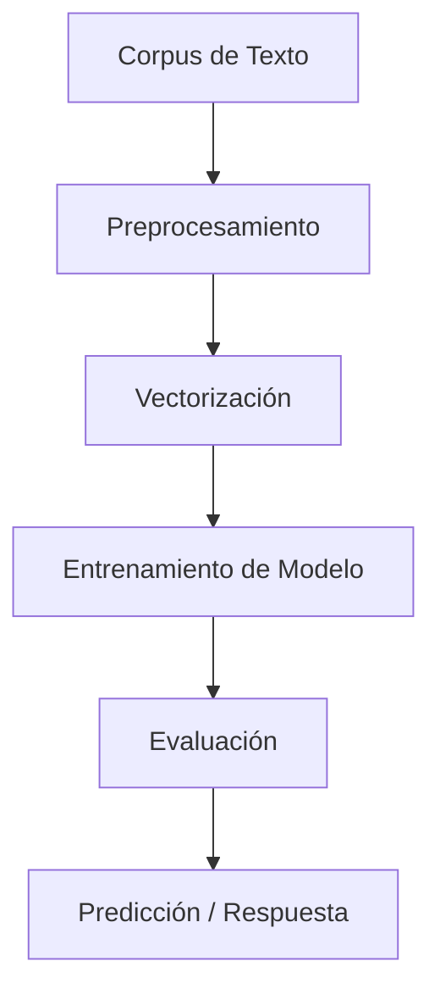

# Procesamiento de Lenguaje Natural.

Este repositorio contiene el desarrollo de los **Desafíos** realizados en el marco de la materia **Procesamiento de Lenguaje Natural (PLN)**, correspondiente a la **Especialización en Inteligencia Artificial** de la **Facultad de Ingeniería de la Universidad de Buenos Aires (FIUBA)**.

👤 **Autor:** Marcelo Adrián Más Valdecantos  
📘 **Código de alumno:** a1811  

---

## Contenido del repositorio

### 1️ Desafío 1 – Vectorización y Clasificación de Textos

> **Tema:** Dataset *20 Newsgroups*, vectorización con **TF-IDF**, clasificación con **Naïve Bayes** y análisis de similaridad entre documentos.

> - Vectorizamos con **TF-IDF** todo el corpus porque ayuda a destacar palabras que son importantes en un documento pero no comunes en todos, luego elegimos al azar 5 documentos.

> - Implementamos el concepto de **"cosine similarity"**, que mide qué tan similares son dos vectores en términos de su ángulo para encontrar los 5 documentos más similares.

> - Exploramos:
>   - Distintos modelos de **Naïve Bayes**:
>     - `MultinomialNB` (bueno para textos en general)
>     - `ComplementNB` (mejor en conjuntos desbalanceados)
>   - Distintas configuraciones del vectorizador `TfidfVectorizer`:
>     - Variaciones en `ngram_range`, `min_df` y `stop_words`.
>   - Para encontrar la mejor combinación que capte mejor el contenido del texto.

> - Finalmente, se explora el impacto de distintas representaciones vectoriales sobre el rendimiento del modelo.
> - Por ultimo:
>     - Buscamos analizar similaridad entre palabras usando la representación TF-IDF transpuesta, para trabajar con vectores          de palabras.
>     - Se eligen 5 palabras específicas y comprensibles, en lugar de aleatorias, para evitar términos irrelevantes o muy             poco frecuentes.
>     - Calculamos la similaridad del coseno entre palabras para identificar aquellas que comparten un contexto de uso                similar.
> --> Este enfoque demostró que es posible descubrir relaciones semánticas relevantes entre palabras, basadas en su coaparición en contextos similares. Además, al seleccionar palabras manualmente y comprensibles, se facilitó una interpretación significativa de los resultados.

--- 

### Desafío 2 – Entrenamiento de Embeddings con Word2Vec

> **Tema:** Crear vectores de palabras utilizando **Gensim** y el modelo **Word2Vec**, entrenado sobre un corpus propio (el poema *Martín Fierro*). Se analizan relaciones semánticas entre términos y se visualiza su organización en el espacio de embeddings.

#### Preparación del corpus

> - Se leyó el texto *martin_fierro.txt* línea por línea.
> - Cada línea fue tokenizada con `text_to_word_sequence`, convirtiendo el corpus en una lista de listas de palabras limpias (minúsculas, sin puntuación).
> - El resultado fue un conjunto de **2449 líneas** y un vocabulario de **557 palabras distintas** (tras aplicar `min_count=3`).

#### Entrenamiento del modelo

> - El modelo fue entrenado durante **20 épocas**.
> - Se observó una disminución progresiva de la pérdida, señal de que el modelo aprendía relaciones contextuales entre palabras en el poema.

#### Ensayo del modelo

> - Se utilizaron funciones como `most_similar` y `get_vector` para:
>   - Explorar términos cercanos en el espacio semántico.
>   - Visualizar cómo una palabra se representa como vector.
> - Ejemplo: se analizaron palabras como `"el"` y `"cantar"` para verificar la coherencia de los vecinos semánticos aprendidos.

#### Visualización de embeddings

> - Se aplicó **TSNE** para reducir la dimensionalidad a 2D.
> - Se graficaron los **200 vectores más frecuentes** con `plotly`, observando agrupaciones temáticas y semánticas.

> --> Este desafío demostró cómo entrenar embeddings desde cero sobre un corpus literario permite capturar **relaciones contextuales profundas entre palabras**. A diferencia de métodos basados en frecuencia como TF-IDF, Word2Vec genera representaciones que reflejan **la estructura semántica del lenguaje**, lo que habilita tareas de análisis léxico, descubrimiento de sinónimos y visualización de agrupamientos conceptuales.

--- 

### Desafío 3 – Modelo de Lenguaje a Nivel de Caracteres con RNN

> **Tema:** Construcción y entrenamiento de un modelo de lenguaje basado en caracteres utilizando redes recurrentes. Se entrena el modelo sobre un corpus literario y se evalúa su capacidad para generar texto, considerando estrategias de generación y el uso de la perplejidad como métrica de validación.

#### Preparación del corpus

> - Se utilizó nuevamente el texto del *Martín Fierro*, cargado y preprocesado como una única secuencia continua.
> - Se definió un vocabulario de caracteres (`char2idx`, `idx2char`) para tokenizar el texto.
> - El corpus se convirtió en una secuencia de enteros representando cada carácter.
> - Se dividió el conjunto en entrenamiento y validación, definiendo un tamaño de contexto para generar secuencias.

#### Arquitectura del modelo

> - Se construyó un modelo **SimpleRNN** con la siguiente arquitectura:
>   - Capa `TimeDistributed` con codificación one-hot por carácter.
>   - Capa `SimpleRNN` con 200 unidades, dropout y recurrent dropout.
>   - Capa `Dense` final con activación `softmax` para predecir el próximo carácter.
> - El modelo se compiló con pérdida `sparse_categorical_crossentropy` y optimizador `rmsprop`.

---

#### Callback para Perplejidad

> - Se implementó un **callback personalizado** para calcular la **perplejidad** sobre los datos de validación al final de cada época.
> - La perplejidad mide la "incertidumbre" del modelo en la predicción del siguiente carácter.
> - También se usó este callback para aplicar **early stopping** cuando la perplejidad dejaba de mejorar.

#### Entrenamiento

> - El modelo fue entrenado con `batch_size=256` durante hasta 20 épocas.
> - Se guardó automáticamente el modelo con mejor score de perplejidad.

#### Inferencia interactiva

> - Se cargó el mejor modelo entrenado y se construyó una interfaz con `Gradio` para generar texto.
> - Dada una secuencia de entrada, el modelo predice el siguiente carácter usando **greedy search**.
> - Esta herramienta permite probar la capacidad del modelo para continuar textos de forma coherente.

> --> Este desafío mostró cómo entrenar un modelo de lenguaje a nivel de caracteres utilizando **redes neuronales recurrentes**, evaluando su desempeño con perplejidad y utilizando callbacks personalizados. La tokenización por caracteres permite trabajar con vocabularios reducidos y aprender patrones ortográficos y gramaticales, aunque requiere más pasos para capturar significado a nivel semántico. El uso de una interfaz interactiva facilita la exploración cualitativa de la calidad del modelo.

---

### 4️ Desafío 4 – Sistema de Pregunta-Respuesta
> **Tema:** Desarrollo de un sistema QA (*Question Answering*) basado en modelos de lenguaje preentrenados.  
> Se trabaja con técnicas avanzadas de representación contextualizada para responder preguntas sobre un corpus específico.

---

## Tecnologías utilizadas

- Python 3.x
- Scikit-learn
- Pandas / NumPy
- NLTK / spaCy
- Transformers (Hugging Face)
- Jupyter Notebooks

---

## Sobre la materia

La materia **Procesamiento de Lenguaje Natural (PLN)** aborda técnicas, modelos y algoritmos para permitir que las máquinas comprendan, interpreten y generen lenguaje humano. Se estudian desde métodos estadísticos clásicos hasta modelos de aprendizaje profundo basados en redes neuronales.

---

##  Recursos complementarios

- [Documentación de Scikit-learn](https://scikit-learn.org/stable/)
- [Guía de NLP de Hugging Face](https://huggingface.co/course/chapter1)
- [Curso de PLN de Stanford (CS224n)](http://web.stanford.edu/class/cs224n/)

---

---

## Cómo utilizar este repositorio

1. Clonar el repositorio o descargarlo como archivo ZIP.
2. Abrir los archivos `.ipynb` con Jupyter Notebook o Google Colab.
3. Ejecutar las celdas secuencialmente para reproducir los resultados.
4. Revisar los comentarios y outputs en cada notebook para seguir el flujo de análisis.

> Es recomendable crear un entorno virtual e instalar las dependencias necesarias con `pip install -r requirements.txt` si aplica.

---

## Resumen de Resultados y Aprendizajes

- Se aplicaron diversas técnicas de preprocesamiento de texto, vectorización y clasificación, lo que permitió comparar enfoques clásicos y modernos en PLN.
- Se experimentó con **modelos supervisados**, **similaridad semántica** y **modelos de lenguaje preentrenados**.
- Se adquirieron habilidades prácticas para construir pipelines de procesamiento de texto, incluyendo tareas de clasificación, análisis de sentimientos y QA.

---

##  Diagrama conceptual (proceso típico en PLN)

Este diagrama representa el flujo común de trabajo aplicado en los diferentes desafíos del curso.
