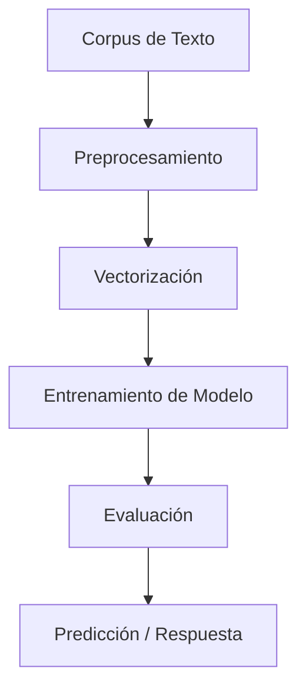

# Procesamiento de Lenguaje Natural.

Este repositorio contiene el desarrollo de los **Desafíos** realizados en el marco de la materia **Procesamiento de Lenguaje Natural (PLN)**, correspondiente a la **Especialización en Inteligencia Artificial** de la **Facultad de Ingeniería de la Universidad de Buenos Aires (FIUBA)**.

👤 **Autor:** Marcelo Adrián Más Valdecantos  
📘 **Código de alumno:** a1811  

---

## Contenido del repositorio

### Desafío 1 – Vectorización y Clasificación de Textos

**Tema:**  
Análisis del dataset *20 Newsgroups*, utilizando técnicas de vectorización con **TF-IDF**, clasificación con modelos de **Naïve Bayes**, y estudio de **similaridad entre documentos**.

---

#### Vectorización y Similaridad

- Se vectorizó todo el corpus con **TF-IDF** porque permite destacar palabras importantes dentro de cada documento, restando relevancia a términos comunes en todos los textos.
- A partir del corpus, se eligieron al azar **5 documentos** y se implementó el cálculo de **similaridad del coseno** (*cosine similarity*) para identificar los **5 documentos más similares** a cada uno de ellos.
- La similaridad del coseno evalúa el **ángulo entre vectores**, interpretando cuán alineadas están sus representaciones en el espacio vectorial.

---

#### 🔹 Exploración de Modelos de Clasificación

Se exploraron múltiples configuraciones para optimizar el desempeño del modelo (F1-score macro):

1. **Modelos Naïve Bayes:**
   - `MultinomialNB`: adecuado para clasificación de texto en general.
   - `ComplementNB`: diseñado para manejar mejor datasets con clases desbalanceadas.

2. **Parámetros de vectorización (`TfidfVectorizer`):**
   - `ngram_range`: para incluir unigramas, bigramas y trigramas.
   - `min_df`: para filtrar términos poco frecuentes.
   - `stop_words`: para eliminar palabras comunes irrelevantes (e.g., en inglés).

3. **Evaluación y comparación:**
   - Se midió el rendimiento con **F1-score macro**, que considera el equilibrio de desempeño entre todas las clases.
   - Se identificó la **mejor combinación de modelo y vectorización** que logra captar mejor el contenido del texto y optimiza la clasificación.

---

#### ✅ Conclusión

Este desafío permite observar el impacto de distintas representaciones vectoriales y parámetros de modelos sobre el rendimiento de clasificación en texto. Combinar múltiples configuraciones ayuda a seleccionar la opción más eficaz para capturar patrones semánticos y estructurales del corpus.

### 2️ Desafío 2 – Clasificación de Sentimientos
> **Tema:** Análisis de sentimientos en reseñas de películas.  
> Se implementan estrategias de limpieza, tokenización y vectorización para entrenar modelos supervisados que distinguen polaridad positiva/negativa.

### 3️ Desafío 3 – Clasificación de Texto Multiclase
> **Tema:** Construcción de modelos para clasificación multiclase.  
>  Incluye selección de corpus, ingeniería de características, entrenamiento, evaluación y optimización de modelos.

### 4️ Desafío 4 – Sistema de Pregunta-Respuesta
> **Tema:** Desarrollo de un sistema QA (*Question Answering*) basado en modelos de lenguaje preentrenados.  
> Se trabaja con técnicas avanzadas de representación contextualizada para responder preguntas sobre un corpus específico.

---

## Tecnologías utilizadas

- Python 3.x
- Scikit-learn
- Pandas / NumPy
- NLTK / spaCy
- Transformers (Hugging Face)
- Jupyter Notebooks

---

## Sobre la materia

La materia **Procesamiento de Lenguaje Natural (PLN)** aborda técnicas, modelos y algoritmos para permitir que las máquinas comprendan, interpreten y generen lenguaje humano. Se estudian desde métodos estadísticos clásicos hasta modelos de aprendizaje profundo basados en redes neuronales.

---

##  Recursos complementarios

- [Documentación de Scikit-learn](https://scikit-learn.org/stable/)
- [Guía de NLP de Hugging Face](https://huggingface.co/course/chapter1)
- [Curso de PLN de Stanford (CS224n)](http://web.stanford.edu/class/cs224n/)

---

---

## Cómo utilizar este repositorio

1. Clonar el repositorio o descargarlo como archivo ZIP.
2. Abrir los archivos `.ipynb` con Jupyter Notebook o Google Colab.
3. Ejecutar las celdas secuencialmente para reproducir los resultados.
4. Revisar los comentarios y outputs en cada notebook para seguir el flujo de análisis.

> Es recomendable crear un entorno virtual e instalar las dependencias necesarias con `pip install -r requirements.txt` si aplica.

---

## Resumen de Resultados y Aprendizajes

- Se aplicaron diversas técnicas de preprocesamiento de texto, vectorización y clasificación, lo que permitió comparar enfoques clásicos y modernos en PLN.
- Se experimentó con **modelos supervisados**, **similaridad semántica** y **modelos de lenguaje preentrenados**.
- Se adquirieron habilidades prácticas para construir pipelines de procesamiento de texto, incluyendo tareas de clasificación, análisis de sentimientos y QA.

---

##  Diagrama conceptual (proceso típico en PLN)

Este diagrama representa el flujo común de trabajo aplicado en los diferentes desafíos del curso.
